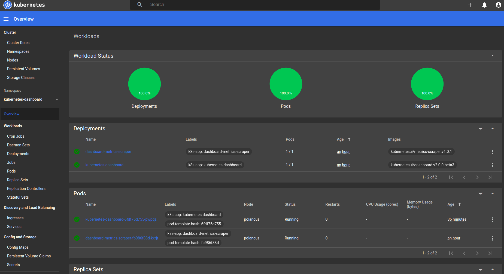

# Server_And_Cloud_Project

## What is this project?
This project is for a subject on my school namely Server and cloud. We needed to make a kubernetes cluster and I chose to do it with a flask application and SQL server. There also needed to be an option to backup this sql.

## Kubectl dashboard:


(Not my image)


## Remove remote access root:
```sql
DELETE FROM mysql.user WHERE User='root' AND Host NOT IN ('localhost', '127.0.0.1', '::1');
```

## Check mysql user access:
```sql
SELECT user,host FROM mysql.user;
```

## Generate SSL keys:
```bash
openssl req -x509 -newkey rsa:4096 -nodes -out cert.pem -keyout key.pem -days 365
```

## Check open ports:
```bash
sudo netstat -tulpn | grep LISTEN
```

## Create Docker image and push to registry:
```bash
docker build -t flask-ryan .
docker tag flask-ryan:latest ryandv123/flask-ryan
docker push ryandv123/flask-ryan
```

## Run Docker container:
```bash
docker container run -p 5000:5000 --name flask-container flask-ryan
```

## Run this project:
```bash
minikube start;
minikube dashboard &
kubectl proxy --address='0.0.0.0' --disable-filter=true &
kubectl apply -f ./db_deploy.yaml && kubectl apply -f ./flask_pot.yaml
```
## Manually Backup the Mysql database:
```bash
bash backup.sql
```
